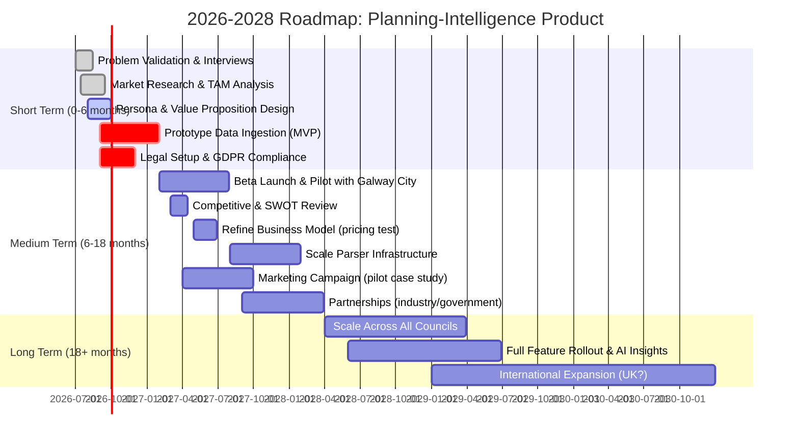

# Planning-Intelligence Product for Ireland: Improvement Framework

## Executive Summary  
This report systematically analyses an early-stage idea for an Irish “planning-intelligence” product and identifies improvements across key dimensions of startup development. We first clarify and validate the problem to solve, then examine market demand and user profiles. A clear **value proposition** is articulated relative to user needs and competitive alternatives, supported by systematic market and competitive analysis. The **technical feasibility** and **business model** are evaluated, and a **go-to-market strategy** is outlined. Legal and regulatory compliance (e.g. GDPR, planning law) and project **risks** are flagged. Throughout, we propose concrete actions, experimental designs, KPIs, and templates (e.g. persona profiles, SWOT matrix) to fill gaps. A prioritized short/medium/long-term roadmap is presented (see mermaid chart below). Metrics and experiments (surveys, A/B tests, prototypes) are recommended to iteratively validate each assumption. Finally, we cite industry and academic resources for further guidance. Overall, this comprehensive framework will help refine the idea into a scalable venture ready for real-world testing.

## Problem Validation  
**Definition:** Problem validation is the process of confirming that a significant customer problem exists before building a solution. Lean Startup methodology emphasizes that *“every startup is a grand experiment”* aiming to answer “should this product be built?”. Rather than assuming demand, founders must test their problem hypotheses with real users.

- **Key Questions:** Who experiences the problem? How severe and frequent is it? What is the cost or pain of the problem to users? Are current solutions inadequate? Would users pay for a solution?
- **Methods/Tools:** Conduct customer interviews and surveys to explore problems, use *design thinking* empathy techniques, consult secondary research (e.g. industry reports) to gauge pain points. Use Lean Canvas or the *Customer Problem Interview* format. Define a testable problem hypothesis with validation criteria.
- **Action Steps:** 
  1. **Hypothesize the Problem:** Draft clear statements like “Galway city planners struggle to aggregate planning data across councils.”  
  2. **Customer Discovery:** Interview ~10–20 potential users (e.g. local planners, architects, developers) asking about their biggest planning-related challenges.  
  3. **Define Success Metric:** Decide what constitutes validation (e.g. “≥60% of interviewed planners confirm this pain,” following a test metric approach).  
  4. **Analyze & Iterate:** Tally responses; refine or reject hypotheses based on feedback. Pivot problem definitions if needed.  
- **Template Example:**  

| Hypothesis Type          | Sample Statement (Planning Product)                                                  |
|--------------------------|-------------------------------------------------------------------------------------|
| **Problem Hypothesis**   | *“Local planners and developers spend too much time manually compiling planning data from multiple council sources.”* |
| **Validation Metric**    | *“If >50% of surveyed planners agree this is a top pain point, we validate the problem.”* |
| **Proposed Solution**    | *“A unified platform that aggregates and visualises planning applications across regions.”* |  

This hypothesis template clarifies what we believe and how to test it. Actual validation must precede any product build.

## Market Need and Sizing  
**Definition:** Market need assesses whether a genuine demand or gap exists in the market for this solution. It involves quantifying customer segments and market size (TAM, SAM, SOM) and ensuring customers are willing to pay for the solution.

- **Key Questions:** What is the Total Addressable Market (TAM) for planning data products in Ireland? Who are the customer segments (e.g. city planners, developers, consultants, public)? What is their willingness to pay? How fast is the market growing (e.g. planning applications data trends)?  
- **Methods/Tools:** Use **market research**: analyze government and industry data (CSO planning permission stats, housing market trends). Estimate TAM by counting all local authorities or planning stakeholders. Survey target users about pricing. Tools like TAM/SAM/SOM calculation, Porter’s Five Forces for industry context, or industry reports on proptech might help.  
- **Action Steps:**  
  1. **Gather Data:** Compile statistics (e.g. 8,177 new planning units in Q1 2025) as proxies for user activity. Use open datasets (e.g. Ireland’s National Planning Application Database).  
  2. **Segment Customers:** Define user personas (see next section) and estimate how many exist in each (e.g. number of planning professionals or firms in Ireland).  
  3. **Validate Need:** Run online surveys or landing-page tests to measure interest and price sensitivity. (For example, an MVP landing page with sign-up form can gauge clicks or sign-ups at different price points.)  
  4. **Analyze Competition:** See if similar products have paying customers (e.g. EirePlan is targeting planning pros).  
- **Template Example (Market Sizing):**

| Metric                  | Value/Assumption                                      |
|-------------------------|-------------------------------------------------------|
| **TAM (annual)**        | All Irish local authorities (31 councils) × Avg. planners per council × Estimated budget/project spend |
| **SAM (serviceable)**   | Planners and developers in top 5 metro areas (e.g. Dublin, Cork, Galway, etc.) |
| **Willingness-to-Pay**  | Percentage of users who sign up/purchase at test prices (to be determined) |

Tracking concrete metrics (number of interested users, expressed budget) will validate market potential. As noted, startups focus on **making sure the product solves a real, moneymaking problem**.

## User Personas  
**Definition:** A user persona is a fictional but data-driven profile of a target user, describing their background, goals, frustrations, and context. Personas help teams empathize with real customers, guiding design and marketing.

- **Key Questions:** Who are the distinct user types? (E.g. *“Regulatory Planner”* at a city council vs *“Architect Developer”* in a firm.) What are their roles, responsibilities, and daily tasks? What problems do they face with current planning processes?  
- **Methods/Tools:** Conduct qualitative interviews and observational studies. Use Persona creation templates (e.g. NN/g’s guidelines). Supplement with demographic/firmographic data if available (e.g. number of city planners vs county planners).  
- **Action Steps:**  
  1. **List Candidate Segments:** Brainstorm potential user groups (urban planner, town council official, property developer, environmental consultant).  
  2. **Collect Data:** Interview representatives (even informally) to gather quotes, responsibilities, pain points.  
  3. **Draft Persona Profiles:** For each major segment, fill a persona template (see example below). Include: name, role, goals, frustrations, tech-savviness, and a narrative scenario.  
  4. **Validate Personas:** Share drafts with people in those roles or show persona to interviewees to refine accuracy.  

- **Template Example (Persona Profile):**

| **Persona** | **Regulatory Planner (“Seán”)** |
|-----------------------|------------------------------|
| **Role**              | Senior Planner at city council |
| **Goals**             | Manage planning applications efficiently; ensure compliance and transparency. |
| **Frustrations**      | Manual data collection from multiple sources; inconsistent file formats; missed deadlines. |
| **Tech Comfort**      | Moderate (uses GIS tools occasionally); values clear dashboards. |
| **Quote**             | “I spend hours compiling reports from different council lists.” |

| **Persona** | **Developer/Architect (“Aoife”)** |
|-------------|-----------------------------------|
| **Role**    | Architect for a regional developer |
| **Goals**   | Quickly assess site feasibility across jurisdictions; meet planning deadlines. |
| **Frustrations** | Lack of centralized info; repetitive paperwork for each council; uncertainty over application status. |
| **Tech Comfort** | High (uses CAD/GIS tools); expects real-time data access. |
| **Quote**   | “It’s hard to know where my application really stands without chasing many sources.” |

Using personas ensures product features and messaging *align with real user needs*, not abstract assumptions.  

## Value Proposition  
**Definition:** A value proposition is a clear statement of the unique benefits a product delivers to customers, answering why customers should choose it. It focuses on customer needs, pains, and gains, and highlights differentiation.

- **Key Questions:** What specific problem (pain) does our product solve for each persona? What measurable benefits (gains) will they get? How are we different from doing nothing or using an alternative? Are emotional/social jobs addressed or only functional?  
- **Methods/Tools:** Use the **Value Proposition Canvas** (Strategyzer) to map customer *jobs, pains, gains* to product features (pain relievers, gain creators). Iteratively test messaging with users. Perform interviews focusing on “How would this feature help you?” or usability tests.  
- **Action Steps:**  
  1. **List Customer Jobs/Pains/Gains:** Based on personas, enumerate key customer jobs (e.g. “Track planning app status”), pains (e.g. “delay from missing docs”), and desired gains (e.g. “faster approvals”).  
  2. **Map Product Features:** Sketch how product elements (e.g. unified dashboard, alerts, GIS mapping) directly alleviate those pains or add gains.  
  3. **Craft Statements:** Formulate crisp value proposition lines. For example: *“A unified Irish planning dashboard that saves city planners hours per week by automatically aggregating and updating applications from all local authorities.”*  
  4. **Validate with Users:** Present drafts to target users or via landing-page copy A/B tests to see if it resonates (e.g. click-through rates, conversions). Refine based on feedback.  

- **Template Example (Value Proposition Canvas snippet):**  

| **Customer Jobs**                      | **Pains**                                    | **Gains**                                               |
|----------------------------------------|---------------------------------------------|---------------------------------------------------------|
| Approve or review planning applications | Time-consuming manual data gathering        | Faster decision-making, reduced errors                  |
| Coordinate across jurisdictions        | Confusion from inconsistent formats/sites   | Single source of truth, certainty of current info       |
| Stay compliant with regulations        | Risk of missing deadlines                   | Automated alerts/notifications for key deadlines        |

| **Our Solutions (Features)**           | **Pain Relievers**                           | **Gain Creators**                                       |
|----------------------------------------|---------------------------------------------|---------------------------------------------------------|
| Centralised planning data dashboard   | Eliminates manual aggregation               | Provides one-click reports and maps                     |
| Automated status tracking             | Reduces risk of missed updates              | Real-time notifications on application status changes    |
| Cross-authority geospatial search     | Resolves format inconsistencies             | Enables instant cross-council site analysis             |

From this analysis, a **compelling value proposition** emerges: *“We help Irish planning professionals spend less time chasing data and more time making decisions. Our platform automatically collates all municipal planning applications in one place (reducing workload by X%) and highlights deadlines/changes so you never miss critical updates.”* Such clarity is vital for product–market fit.

## Competitive Landscape  
**Definition:** Competitive analysis assesses existing solutions and market players to identify opportunities and threats. Frameworks like SWOT (Strengths, Weaknesses, Opportunities, Threats) or Porter’s Five Forces help evaluate one’s position.

- **Key Questions:** Who are our direct competitors (e.g. EirePlan, Precedent.ai) or substitutes (e.g. current paper registers, government portals)? What are their features, business models, and market share? What are their strengths/weaknesses? Where is the unique niche for our product?  
- **Methods/Tools:** Perform a **SWOT analysis**: list strengths/weaknesses of the product vs competitors, plus external opportunities/threats (e.g. new planning laws or tech trends). Use **Porter’s Five Forces** (supplier power, buyer power, threat of new entrants, substitutes, rivalry) for industry context.  
- **Action Steps:**  
  1. **Identify Competitors:** Research similar Irish or international planning data tools (e.g. *EirePlan*, *Precedent.ie*). Include indirect competitors (GIS platforms, manual processes).  
  2. **Gather Intel:** Collect public information (websites, user reviews, feature lists). If possible, get demos or trial accounts.  
  3. **Conduct SWOT:** For each major competitor and for our concept, fill a SWOT grid. (E.g. “Our Strength: local Irish focus; Weakness: limited current user base; Opportunity: unmet need for multi-council data; Threat: new entrants or policy changes.”)  
  4. **Positioning:** Based on gaps (e.g. competitors lack multi-council aggregation), refine our product’s differentiation strategy. For example, highlight any proprietary data pipelines or faster updates.  

- **Template Example (Competitor Matrix):**

| Competitor / Feature        | Coverage of All Councils | Real-time Updates | AI Analysis | Ease of Use | Pricing   |
|-----------------------------|--------------------------|-------------------|-------------|-------------|-----------|
| **EirePlan**                | Partial (β focusing on some cities)  | No (weekly updates)   | Yes (knowledge engine) | Moderate (UI learning curve) | Subscription |
| **Precedent.ai**            | Unknown (aims to collect) | ?? (marketing claims) | Yes (AI audit) | Moderate | Early access pricing |
| **Manual / Council Sites**  | Disconnected             | No                  | No          | Low (familiar) | Free/None |
| **Our Product (proposed)**  | Full Ireland (31 councils) | Yes (automated scraping) | Optionally Yes (report insights) | Designed for planners (targeted UI) | TBD |

This matrix highlights where we can win (e.g. full nation coverage, faster updates, planner-centric UI). Competitive analysis prevents building unwanted features and reveals strategic opportunities. A SWOT/Porter framework ensures we cover both internal and external factors systematically.

## Technical Feasibility  
**Definition:** A technical feasibility study assesses whether the product can be built with existing technology, resources, and within budget/time constraints. It asks if the project is practical given its technical requirements.

- **Key Questions:** Can we reliably ingest planning data from all sources (PDFs, DOCX, online portals)? Do we have (or can we obtain) necessary skills (e.g. OCR, GIS, web scraping)? Are required datasets (mapping, councils, zoning rules) available and license-free? What architecture is needed for scaling (cloud vs local, database choices)?  
- **Methods/Tools:** Create prototypes or *spikes*: e.g. try extracting data from one council’s planning PDF. Evaluate technologies (e.g. PostgreSQL+PostGIS as suggested vs simpler storage). Consult technical experts or forums for tricky tasks (e.g. parsing OCR'd plans). Review infrastructure options (servers, cloud services).  
- **Action Steps:**  
  1. **Technology Audit:** List all tech requirements (web crawling, database, front-end). For example, planning documents often need OCR; evaluate Tesseract or Google Vision APIs. Check data processing needs (fast indexing for maps).  
  2. **Proof of Concept:** Build small MVP components. For instance, implement a parser for one type of planning list to test accuracy (as the project brief notes multiple parser families required).  
  3. **Assess Team/Partner Needs:** Determine if you need to hire or contract expertise (GIS specialist, data engineer).  
  4. **Feasibility Analysis:** Using a checklist, verify each major component’s viability (see template below). Identify showstoppers (e.g. some councils may not have exportable data).  

- **Template Example (Technical Feasibility Checklist):**

| **Question**                              | **Yes / No / Notes**                          |
|-------------------------------------------|-----------------------------------------------|
| **Data Accessibility:** Are planning data sources accessible (APIs, lists, maps)? | e.g. Galway City: weekly PDF (Yes, tested); Mayo: website list (Yes via scraping) |
| **Parser Tools:** Can documents (PDF/DOCX) be parsed reliably?            | e.g. Tesseract OCR yields 95% accuracy in trials; some tables parse well with regex. |
| **Infrastructure:** Can we support geo-queries? (e.g. PostGIS)         | Proposed: PostgreSQL+PostGIS (as recommended). Trials are successful. |
| **Scalability:** Will design support 31 councils and future growth?       | Initial multi-tenant design; cloud-based scaling plan ready. |
| **Resources:** Do we have team skills or budget for all tech?        | Need a geospatial developer (gap); budget must cover server costs and OCR licensing. |

By systematically addressing these items, we ensure the project is technically doable. According to [42], a feasibility study should identify obstacles early to avoid costly overruns. Any “no” answers highlight critical gaps requiring resolution before full investment.

## Business Model  
**Definition:** A business model is a plan outlining how the company creates, delivers, and captures value to generate profit. It specifies the value proposition, target customers, revenue streams, cost structure, and key partnerships.

- **Key Questions:** How will we charge users? (e.g. subscription, freemium, per-app fee, licensing to councils). What pricing models suit each user persona? What are the costs (data hosting, maintenance, staffing)? Are there partnership opportunities (e.g. local government grants, data-sharing agreements)?  
- **Methods/Tools:** Use the **Business Model Canvas** (9-block framework) to map out elements (Customer Segments, Value Propositions, Channels, Customer Relationships, Revenue Streams, Key Activities, Key Resources, Key Partners, Cost Structure). This visual tool keeps focus on core drivers. Perform simple financial modeling for different pricing scenarios.  
- **Action Steps:**  
  1. **Complete BMC:** Fill out each block. For example, revenue streams might include monthly subscription for planners, or data licensing for researchers. Costs include scraper development, database hosting, personnel. Identify key partners (e.g. municipal planning departments for data access).  
  2. **Test Willingness to Pay:** In parallel to problem validation, survey potential customers about acceptable pricing. Possibly offer beta users discounted pricing to gauge interest.  
  3. **Refine Monetization:** Decide if multiple business models are needed (B2B sales to consulting firms vs B2G sales to government agencies).  
  4. **Update As We Learn:** Adapt the canvas based on user feedback and market realities. Investors value flexibility here; per Investopedia, successful startups often **pivot their business model** as they learn.  

While a Business Model Canvas is one-page, here is an excerpt of key blocks for illustration:

| **BMC Block**            | **Notes (Planning Intelligence Product)**                                                              |
|--------------------------|-------------------------------------------------------------------------------------------------------|
| **Customer Segments**    | Municipal planning departments; private developers/architects; consultants; NGOs (housing data users). |
| **Value Propositions**   | Unified planning database; time savings; compliance risk reduction; data-driven insights.              |
| **Channels**             | Direct sales to councils; online subscription portal; partnerships with industry associations.         |
| **Revenue Streams**      | SaaS subscriptions (tiered by org size); one-time consulting fees for custom reports; grant funding.    |
| **Key Resources**        | Database and scraper infrastructure; planning data licenses; team of developers and planning experts.  |
| **Cost Structure**       | Cloud hosting (PostgreSQL, storage); data procurement/licensing; salaries (tech & planning analysts).    |

The canvas approach clarifies priorities. For example, if early revenue seems weak in one segment, focus may shift (pivot) to another. The Investopedia definition stresses that *“business models can be varied… direct sales, subscription, franchising, etc.”* and that models should adapt over time. Hence, we must remain flexible.

## Go-to-Market Strategy  
**Definition:** A go-to-market (GTM) strategy is a tactical plan outlining steps to reach and acquire the first customers in a new market or segment. It specifies the channels, messaging, and conversion tactics to efficiently launch the product.

- **Key Questions:** Who is the **initial ideal customer profile** (ICP)? Which marketing/sales channels (e.g. direct outreach to councils, industry events, content marketing) will reach them? What is our messaging and pitch for each persona? What milestones define success (early sign-ups, pilot projects)?  
- **Methods/Tools:** Start with ICP and channel selection. Use the concept of TAM, SAM, SOM for market definition. Develop a marketing plan (social media, trade show appearances, cold outreach) and sales pipeline. Continuously measure results (web traffic, demo requests) and adjust.  
- **Action Steps:**  
  1. **Define GTM Elements:** According to Antler, a robust GTM should define the market, ideal customer, product messaging, distribution channels, and marketing plan. Assemble these components into a launch plan.  
  2. **Build Awareness:** Create a simple website or landing page describing the product (with value props from above), capture emails. Publish blog posts or white papers on planning inefficiencies to attract organic interest.  
  3. **Early Adopters:** Reach out to contacts in one council to pilot the system (e.g. Galway City). Use case studies from pilots to convince other buyers. Consider a *beta user waitlist* to generate buzz (as suggested in startup GTM advice).  
  4. **Iterate Messaging:** Use feedback from sales calls to refine the pitch. The Antler guide emphasizes that GTM is iterative – if “people say ‘I don’t get it’”, adjust the story until a clear pitch emerges.  
- **Template Example (GTM Plan Outline):**  

```
- *Market Definition:* Municipal planners and developers in Ireland (TAM=~X councils × Y planners). 
- *ICP Persona:* "Primary-Seán the City Planner" who values time savings.
- *Key Channels:* LinkedIn ads to Irish planning professionals; speak at Irish planning conferences; partnerships with professional bodies.
- *Messaging:* Focus on "save hours per week" and "avoid missed deadlines".
- *Sales Funnel:* Download of whitepaper → webinar demo → pilot project → full subscription.
- *Metrics:* Number of pilot agreements signed; lead conversion rate; customer acquisition cost (CAC).
```

A well-crafted GTM plan reduces launch risk. As a testament to its importance, a Harvard case showed a tech startup failing until consultants focused its GTM on three enterprise customers. We will similarly test and refine our approach until we achieve initial traction.

## Legal and Regulatory Considerations  
**Definition:** These are laws and regulations the product must comply with. In Ireland/EU, this includes data protection (GDPR), planning-specific laws, intellectual property, and possibly procurement rules for selling to government.

- **Key Questions:** Will we handle personal data (e.g. user accounts, email lists) triggering GDPR obligations (consent, data storage)? Are there copyright issues with planning documents? Do we need official permissions to redistribute council data? Must we comply with public-sector procurement standards if selling to government agencies?  
- **Methods/Tools:** Review relevant regulations. For GDPR, follow guidance or checklists (e.g. map personal data usage). Consult a legal advisor on media law (for document reuse) and on Irish planning statutes if embedding official data. Look for any industry “codes of practice” (e.g. Open Data initiative rules).  
- **Action Steps:**  
  1. **Data Compliance:** If collecting user data (sign-ups), implement GDPR measures: privacy policy, opt-in forms, data encryption, and a data protection officer if required. (Recommend using templates from data-protection authorities.)  
  2. **Planning Data Rights:** Verify licenses on open planning datasets (the Department publishes the NPAD under Creative Commons). Ensure we credit sources and respect any reuse terms.  
  3. **Contracts & Terms:** Draft Terms of Service and End-User License Agreements. Ensure clarity on liability (especially as EirePlan emphasizes planners own final decisions).  
  4. **Regulatory Approvals:** If needed, register the business formally (e.g. as an Irish company), and if targeting public contracts, investigate relevant procurement processes.  

Compliance is non-negotiable: as noted by competitors, planning is a *regulated, high-stakes domain*. We should budget for at least an initial legal consultation, and plan ongoing review of any regulatory changes (e.g. new digital planning policies).  

## Risks and Mitigation  
**Definition:** Risk management is the systematic process of identifying, analyzing, and responding to uncertainties that could impact the project. It covers technical, market, financial, and other risks.

- **Key Questions:** What can go wrong? (E.g. data sources may change format, a competitor raises funding and moves faster, adoption is slower than expected.) How severe and likely are these events? What are the potential impacts on schedule, cost, or project viability?  
- **Methods/Tools:** Create a **Risk Register**. For each risk, estimate *probability* and *impact*, and assign mitigation actions. Techniques like FMEA (Failure Mode and Effects Analysis) or SWOT (as above) help enumerate risks. ISO 31000 and PMI PMBOK guidelines suggest iterative risk reviews.  
- **Action Steps:**  
  1. **Identify Risks:** Brainstorm across categories: *Technical* (e.g. server downtime, parsing errors), *Market* (no customers), *Financial* (run out of funds), *Legal* (compliance breach).  
  2. **Assess & Prioritize:** Rate each risk’s likelihood and impact (e.g. 1–5). Focus on high-likelihood/high-impact items first.  
  3. **Mitigation Plans:** For each top risk, outline responses. For example, if a key data source changes format, keep raw files for replay and develop agile parsers (as the product brief suggests questioning whether to keep raw sources).  
  4. **Monitoring:** Assign team members to monitor triggers (e.g. council website changes). Regularly revisit the risk register (e.g. monthly) to update or add risks.  
- **Template Example (Risk Register excerpt):**

| **Risk**                            | **Likelihood** | **Impact** | **Mitigation Strategy**                                        |
|-------------------------------------|---------------|-----------|---------------------------------------------------------------|
| Council website scraping breaks     | Medium        | High      | Maintain historical data dumps; modular scraper design for quick updates. |
| Insufficient funding (runway ends)  | Medium        | High      | Bootstrap by MVP; seek pre-sales/pilots; cut non-essential costs. |
| Low user adoption                   | Medium        | High      | Early marketing surveys; adjust proposition; seek user feedback loops. |
| Data privacy compliance breach      | Low           | High      | Implement GDPR controls; restrict data collection to necessary. |
| Strong competitor launches similar  | Low           | Medium    | Differentiate on local insight; form partnerships for market access. |

Managing risk is essential in high-uncertainty startups. The PMBOK defines risk management precisely as “identifying, analyzing, and responding to project risks”. This structured approach reduces surprises and informs decision-making.

## Metrics & KPIs  
**Definition:** Key Performance Indicators (KPIs) are quantifiable measures to track progress toward objectives. In early startups, focus is often on customer-centric metrics (acquisition, activation, retention) and business health (CAC, LTV, MRR).

- **Key Questions:** What metrics indicate we are learning and growing? Common startup metrics include user acquisition (sign-ups, active users), engagement (frequency of use, NPS), retention (churn rate), and financial (CAC, Lifetime Value). For our product, also track data accuracy rates (parser error %) and time saved. Which metrics are “actionable” (i.e. guide a clear next step) versus vanity metrics?  
- **Methods/Tools:** Embed analytics (e.g. Google Analytics) in the product to track usage. Use CRM or spreadsheets to log outreach and conversion. Conduct regular metric reviews. Adopt the “Build-Measure-Learn” feedback loop with hypotheses tied to metrics (e.g. *“If >30% of trials convert, pursuit sales”*).  
- **Action Steps:**  
  1. **Define Leading Metrics:** Choose 3–5 core metrics (e.g. weekly active planners, feature usage, conversion rate from lead to paying user, net promoter score).  
  2. **Set Targets:** Assign baseline and target values (e.g. achieve 50 paid users within 6 months, or <10% churn).  
  3. **Experimentation:** Use A/B tests (e.g. different website copy) and surveys to iteratively improve metrics. For instance, test two value proposition headlines and track which yields more demo requests.  
  4. **Dashboard:** Create a simple KPI dashboard (even a spreadsheet) that is updated weekly. Share with the team to maintain accountability.  

- **Sample Metrics Table:**

| **Metric**            | **What It Measures**                | **Target**          | **Frequency** | **Method**               |
|-----------------------|-------------------------------------|---------------------|--------------|-------------------------|
| Active Users          | Number of unique planners logging in | 100 within 3 months | Weekly       | Analytics (login tracking) |
| Conversion Rate       | % of trials converting to paid       | ≥20%                | Monthly      | CRM / Subscription stats |
| Customer Acquisition Cost (CAC) | $ spent per new customer         | <$500              | Quarterly    | Finance tracking         |
| Time Saved           | Avg. hours planners save/week         | ≥5 hours            | Biannual     | Survey / self-report     |
| Net Promoter Score    | Customer satisfaction and loyalty     | ≥40 (good)         | Quarterly    | Customer survey (NPS)    |

As one authoritative source notes, startups should track **CAC, LTV, MRR** to understand financial health. In tandem, product-market fit signals come from user engagement and retention. Regularly reviewing metrics (and adjusting strategy accordingly) is “the boring stuff” that drives startup success. 

## Gap Analysis Checklist  
Based on the above dimensions, key gaps to address include:

- **Problem & Market:** Have we conducted enough user interviews to **validate key problems**? (If not, schedule interviews.) Have we *quantified market size and willingness-to-pay*? 
- **Personas & Value Proposition:** Do we have **2–3 well-defined personas** with validated needs? Are our value propositions tested with real users?  
- **Competition:** Have we identified all major competitors and alternatives? Completed a **SWOT analysis** for our product and top competitors?  
- **Technical:** Are all core technical components feasible (scraping pipelines, GIS database)? Is a prototype (MVP) ready for initial users?  
- **Business Model & GTM:** Has a business model (e.g. pricing tiers) been chosen and tested? Is there a concrete **launch plan** (channels, marketing tasks) in place?  
- **Legal:** Are privacy policies, data licenses, and terms of service drafted? Has GDPR compliance been checked?  
- **Risks & Resources:** Have we listed all major risks with mitigation plans? Is the team resourced (skills, budget) to tackle remaining development?  
- **Metrics:** Do we have dashboards or systems in place to track the agreed KPIs?

Each unchecked item above represents a gap. The next step is a **prioritized roadmap** of actions to close these gaps.

## Prioritized Roadmap  



**Legend:** *Short Term:* validate core assumptions and build MVP; *Medium Term:* launch pilot, iterate features, refine model; *Long Term:* scale, add advanced features, explore new markets. Each task addresses previous gaps (e.g. prototype ingestion closes tech gap, beta launch tests market assumptions).

## Experiments and Next Steps  
To operationalize this plan, we recommend a suite of experiments and KPIs:

- **Surveys and Interviews:** Conduct structured surveys of planners/developers (via email or phone) to validate problem severity and value messaging. Use Likert scales (1–5 pain ratings) to quantify responses.
- **Landing Page Tests:** Create simple landing pages for different value propositions or feature sets. Run small paid ads (e.g. LinkedIn to planning groups) to A/B test which messaging drives sign-ups (a classic marketing experiment).
- **Prototype Demos:** Build clickable mock-ups or early software prototypes and hold UX testing sessions. Measure time on task and satisfaction as metrics.
- **Pricing Experiment:** Offer beta users variable pricing or a freemium model to see what they are willing to pay. Track conversion from trial to paid under each pricing tier.
- **Feature Usage:** In the MVP, instrument feature tracking (e.g. Google Analytics events). A *pirate metrics* approach (Acquisition, Activation, Retention, Referral, Revenue) can guide priorities.
- **Partnership Pilots:** Engage one council or developer as a “canary customer”. Measure the impact (e.g. X hours saved per week) to create a case study.

Sample experiment design (survey):  

```
Goal: Validate the problem of multi-council data aggregation.
Hypothesis: ≥60% of planners spend >2 hours/week on manual data gathering.
Method: Online survey to n=30 planners asking hours spent and pain levels.
Success criteria: If >=18 respondents confirm >2 hours, problem is validated.
```

Each experiment should have a clear **hypothesis, metric, and decision rule**. This is the essence of Lean Startup’s build-measure-learn. 

## Recommended Resources  

- **Lean Startup (Eric Ries)** – foundational methodology emphasizing rapid validated learning and MVPs.  
- **Business Model Canvas and Value Proposition Canvas (Strategyzer)** – tools for succinctly mapping business models.  
- **Nielsen Norman Group – Personas** – guidance on creating and applying user personas.  
- **Investopedia & Harvard Business Review articles** – definitions and examples for SWOT analysis, TAM, GTM pitfalls.  
- **Central Statistics Office (CSO) Ireland** – official planning and construction statistics (e.g. planning permissions reports).  
- **Data.gov.ie – National Planning Applications** – open spatial dataset on all Irish planning applications.  
- **Legal/GDPR compliance checklists** – e.g. Data Protection Commission of Ireland (dataprotection.ie).  
- **Industry reports** – Look for Irish housing market and urban planning industry reports (e.g. from CSO or NTMA).  

By systematically following this framework and iterating based on experiments and feedback, the idea can be matured from concept to validated prototype, dramatically improving the chance of success. The structured approach outlined here — with clear definitions, actionable steps, and prioritized tasks — ensures no major area is overlooked and resources are focused where they deliver the most learning and impact.

